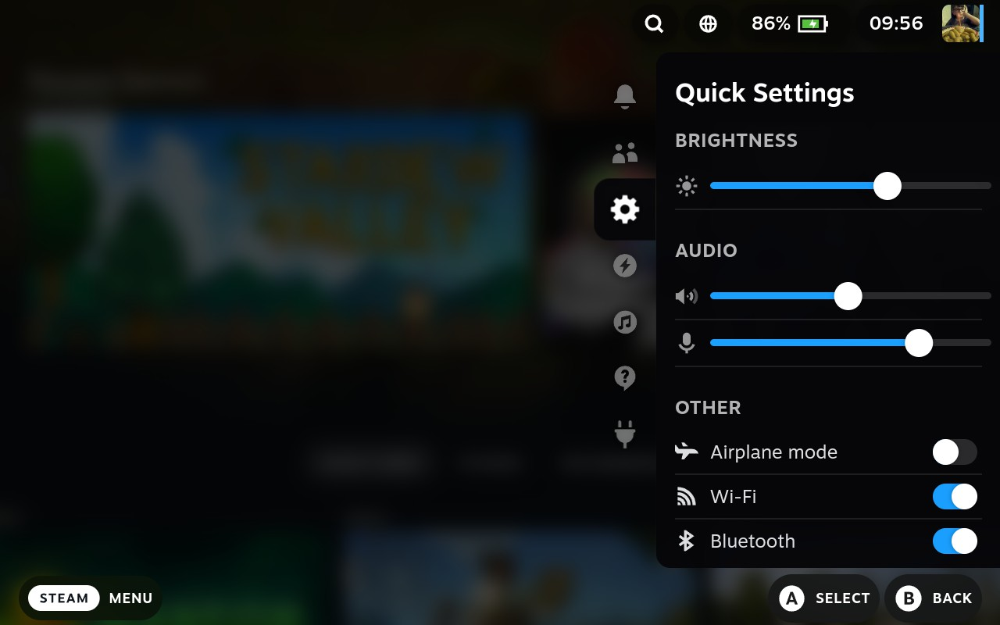

# Modern Steam

Stylesheet, that looks more modern/fluent

- More transparent elements

## Screenshots

## Installation

### Manual

- Enter desktop mode
- Install [Decky Loader](https://github.com/SteamDeckHomebrew/decky-loader) with [CSS Loader](https://deckthemes.com/download/deck)
- Download repository as `.zip` (Code > Download ZIP)
- Unzip `modern-steam-main` folder and move it to `~/homebrew/themes/` folder
- Enter gaming mode back and enable theme in Quick Access menu
